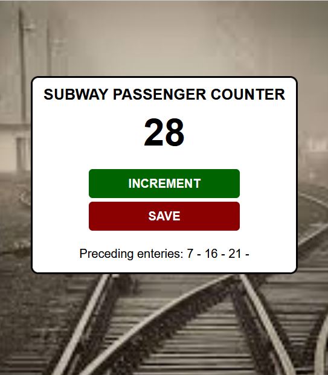

# SUBWAY PASSENGER COUNTER

An application to count the number of passengers entering the subway in different batches.  

  

* Click Increment to increase the number displayed
* Click Save to save the current number in the preceding enteries and set the counter again to 0.  
## TechStack:
* Hyper Text Markup Language
* Cascading Style Sheets
* Basic JavaScript
